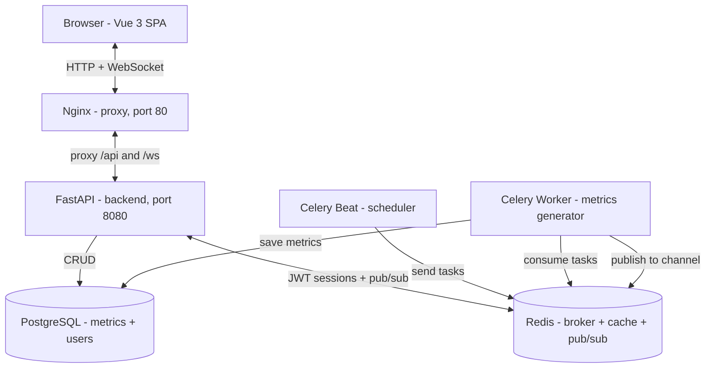
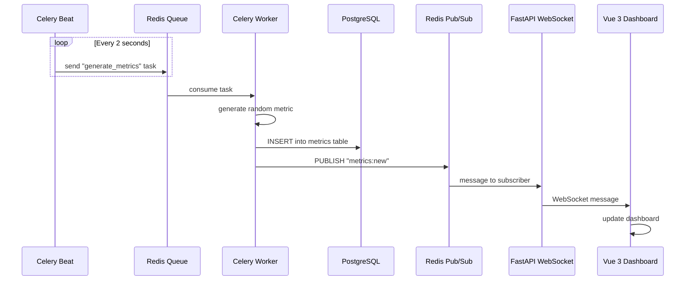
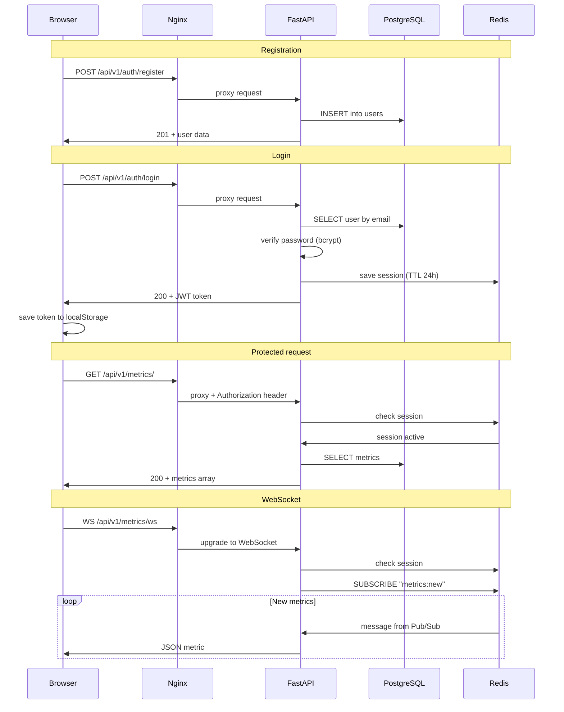

# 📊 Real-Time Metrics Dashboard

Демонстрационное веб-приложение для мониторинга системных метрик в реальном времени. Состоит из трёх компонентов: **Vue 3 SPA** (фронтенд), **FastAPI** (бэкенд) и **Nginx** (прокси-сервер). Метрики генерируются асинхронно через Celery, сохраняются в PostgreSQL и транслируются клиентам через WebSocket с использованием Redis Pub/Sub.

## 🏗️ Архитектура



## 🔄 Поток данных метрик



**По шагам:**
1. **Celery Beat** по расписанию (каждые 2 секунды) отправляет задачу `generate_metrics` в очередь Redis.
2. **Celery Worker** забирает задачу, генерирует случайную метрику (`cpu_usage`, `memory_usage`, `active_users`, `requests_per_sec`).
3. Метрика сохраняется в **PostgreSQL** через SQLAlchemy.
4. После сохранения публикуется сообщение в **Redis Pub/Sub** (канал `metrics:new`).
5. **FastAPI WebSocket**-эндпоинт подписан на этот канал и рассылает новые метрики всем подключённым клиентам.
6. **Vue 3 фронтенд** получает метрику, обновляет сводку и графики в реальном времени.

## 🔐 Поток аутентификации



### Дополнительно: REST API
Клиент может запросить историю метрик через `GET /api/v1/metrics/?limit=100&offset=0` — данные читаются напрямую из PostgreSQL.

## 🚀 Быстрый старт

### Предварительные требования
- [Docker](https://docs.docker.com/get-docker/) и Docker Compose
- [Node.js](https://nodejs.org/) 18+ (только для локальной разработки фронтенда)

### Запуск всего стека

```bash
# 1. Клонировать репозиторий
git clone <repo-url> metrics-dashboard
cd metrics-dashboard
```

# 2. Создать .env файл с переменными окружения (опционально, или скопировать из .env.example)
```bash
cat > .env << EOF
SECRET_KEY=your-secret-key-here
POSTGRES_USER=postgres
POSTGRES_PASSWORD=postgres
POSTGRES_DB=postgres
POSTGRES_HOST=db
REDIS_HOST=redis
REDIS_PORT=6379
REDIS_DB=0
EOF
```

# 3. Запустить все сервисы
```bash
docker compose up -d
```

# 4. Проверить состояние
```bash
docker compose ps
```

После запуска:

- Фронтенд + API: http://localhost (порт 80)
- API напрямую (минуя Nginx): http://localhost:8080
- PostgreSQL: localhost:5432
- Redis: доступен внутри Docker-сети
