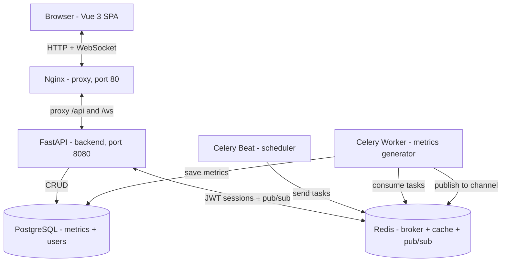
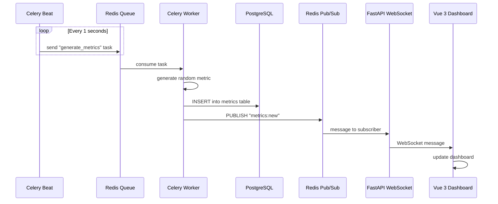
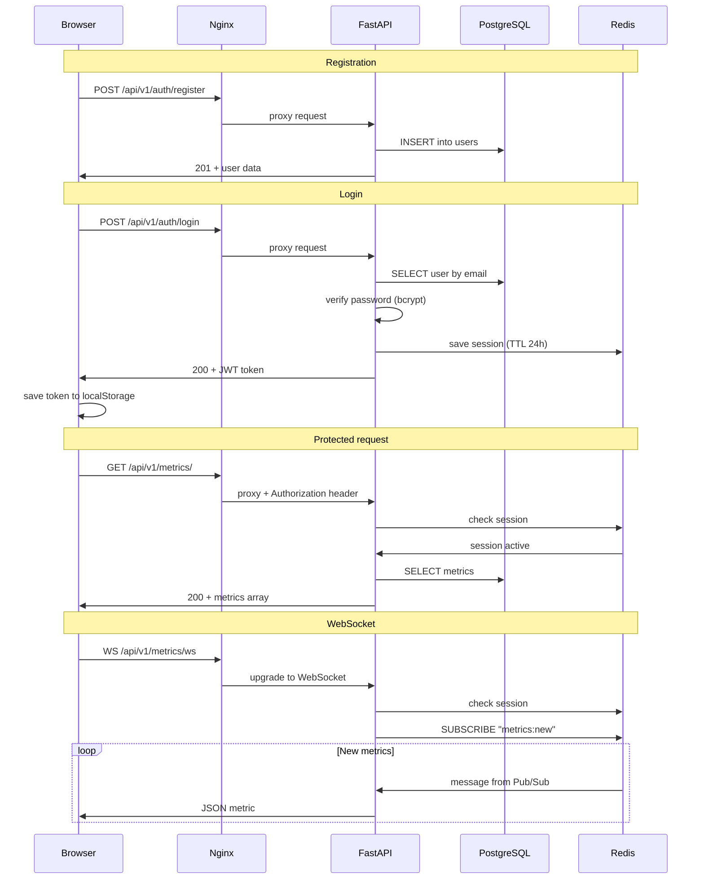

# 📊 Real-Time Metrics Dashboard

**Демонстрационное веб-приложение для мониторинга системных метрик в реальном времени.** Состоит из трёх компонентов: **Vue 3 SPA** (фронтенд), **FastAPI** (бэкенд) и **Nginx** (прокси-сервер). Метрики генерируются асинхронно через Celery, сохраняются в PostgreSQL и транслируются клиентам через WebSocket с использованием Redis Pub/Sub.


---

## 🚀 Быстрый старт

### Предварительные требования
- [Docker](https://docs.docker.com/get-docker/) и Docker Compose
- [Node.js](https://nodejs.org/) 18+ (только для локальной разработки фронтенда)

### Запуск всего стека

```bash
# 1. Клонировать репозиторий
git clone <repo-url> metrics-dashboard
cd metrics-dashboard

# 2. Создать .env файл с переменными окружения (опционально, или скопировать из .env.example)
cat > .env << EOF
SECRET_KEY=your-secret-key-here
POSTGRES_USER=postgres
POSTGRES_PASSWORD=postgres
POSTGRES_DB=postgres
POSTGRES_HOST=db
REDIS_HOST=redis
REDIS_PORT=6379
REDIS_DB=0
EOF

# 3. Запустить все сервисы
docker compose up -d

# 4. Проверить состояние
docker compose ps
```

После запуска:
- Фронтенд + API: **http://localhost** (порт 80)
- API напрямую (минуя Nginx): **http://localhost:8080**
- PostgreSQL: **localhost:5432**
- Redis: доступен внутри Docker-сети

---

## 🏗️ Архитектура системы

### Компоненты


```mermaid
graph TD
    Browser[Browser - Vue 3 SPA]
    Nginx[Nginx - proxy, port 80]
    FastAPI[FastAPI - backend, port 8080]
    PostgreSQL[(PostgreSQL - metrics + users)]
    Redis[(Redis - broker + cache + pub/sub)]
    CeleryBeat[Celery Beat - scheduler]
    CeleryWorker[Celery Worker - metrics generator]

    Browser <-->|HTTP + WebSocket| Nginx
    Nginx <-->|proxy /api and /ws| FastAPI
    FastAPI -->|CRUD| PostgreSQL
    FastAPI <-->|JWT sessions + pub/sub| Redis
    CeleryBeat -->|send tasks| Redis
    CeleryWorker -->|consume tasks| Redis
    CeleryWorker -->|save metrics| PostgreSQL
    CeleryWorker -->|publish to channel| Redis
```

### 🔄 Поток данных метрик


```mermaid
sequenceDiagram
    participant Beat as Celery Beat
    participant Queue as Redis Queue
    participant Worker as Celery Worker
    participant DB as PostgreSQL
    participant PubSub as Redis Pub/Sub
    participant API as FastAPI WebSocket
    participant UI as Vue 3 Dashboard

    loop Every 1 seconds
        Beat->>Queue: send "generate_metrics" task
    end

    Queue->>Worker: consume task
    Worker->>Worker: generate random metric
    Worker->>DB: INSERT into metrics table
    Worker->>PubSub: PUBLISH "metrics:new"
    PubSub->>API: message to subscriber
    API->>UI: WebSocket message
    UI->>UI: update dashboard
```

**По шагам:**
1. **Celery Beat** по расписанию (каждые 1 секунду) отправляет задачу `generate_metrics` в очередь Redis.
2. **Celery Worker** забирает задачу, генерирует случайную метрику (`cpu_usage`, `memory_usage`, `active_users`, `requests_per_sec`).
3. Метрика сохраняется в **PostgreSQL** через SQLAlchemy.
4. После сохранения публикуется сообщение в **Redis Pub/Sub** (канал `metrics:new`).
5. **FastAPI WebSocket**-эндпоинт подписан на этот канал и рассылает новые метрики всем подключённым клиентам.
6. **Vue 3 фронтенд** получает метрику, обновляет сводку и графики в реальном времени.

### 🔐 Поток аутентификации


```mermaid
sequenceDiagram
    participant Browser as Browser
    participant Nginx as Nginx
    participant API as FastAPI
    participant DB as PostgreSQL
    participant Redis as Redis

    Note over Browser,Redis: Registration
    Browser->>Nginx: POST /api/v1/auth/register
    Nginx->>API: proxy request
    API->>DB: INSERT into users
    API->>Browser: 201 + user data

    Note over Browser,Redis: Login
    Browser->>Nginx: POST /api/v1/auth/login
    Nginx->>API: proxy request
    API->>DB: SELECT user by email
    API->>API: verify password (bcrypt)
    API->>Redis: save session (TTL 24h)
    API->>Browser: 200 + JWT token
    Browser->>Browser: save token to localStorage

    Note over Browser,Redis: Protected request
    Browser->>Nginx: GET /api/v1/metrics/
    Nginx->>API: proxy + Authorization header
    API->>Redis: check session
    Redis->>API: session active
    API->>DB: SELECT metrics
    API->>Browser: 200 + metrics array

    Note over Browser,Redis: WebSocket
    Browser->>Nginx: WS /api/v1/metrics/ws
    Nginx->>API: upgrade to WebSocket
    API->>Redis: check session
    API->>Redis: SUBSCRIBE "metrics:new"
    loop New metrics
        Redis->>API: message from Pub/Sub
        API->>Browser: JSON metric
    end
```

### Дополнительно: REST API
Клиент может запросить историю метрик через `GET /api/v1/metrics/?limit=100&offset=0` — данные читаются напрямую из PostgreSQL.

---

## 📁 Структура проекта

```
realtime-metrics-dashboard/
├── backend/                    # Python FastAPI бэкенд
│   ├── src/
│   │   ├── models/            # SQLAlchemy модели
│   │   ├── schemas/           # Pydantic схемы
│   │   ├── routes/            # API роуты
│   │   ├── dependencies/      # FastAPI зависимости
│   │   ├── tasks/             # Celery задачи
│   │   ├── managers/          # Бизнес-логика
│   │   └── migrations/        # Alembic миграции
│   ├── main.py               # Точка входа
│   ├── pyproject.toml        # Python зависимости
│   └── Dockerfile
├── frontend/                  # Vue 3 фронтенд
│   ├── src/
│   │   ├── views/            # Компоненты страниц
│   │   ├── router/           # Vue Router
│   │   ├── stores/           # Pinia хранилища
│   │   └── api/              # API клиент
│   ├── package.json
│   └── Dockerfile
├── nginx/                     # Nginx конфигурация
├── docker-compose.yml         # Docker Compose
├── README.md                  # Этот файл
└── AGENTS.md                  # Конфигурация для AI агентов
```

---

## 🛠️ Разработка

### Локальная разработка (без Docker)

#### Бэкенд
```bash
cd backend

# Установить зависимости
uv sync

# Запустить сервер разработки
uv run uvicorn main:app --reload --host 0.0.0.0 --port 8080

# Запустить Celery worker
uv run celery -A src.celery_app worker --loglevel=info

# Запустить Celery beat
uv run celery -A src.celery_app beat --loglevel=info

# Запустить миграции
uv run alembic upgrade head
```

#### Фронтенд
```bash
cd frontend

# Установить зависимости
npm install

# Запустить сервер разработки
npm run dev
```

### Разработка с Docker

```bash
# Собрать и запустить все контейнеры
docker compose up -d --build

# Остановить все контейнеры
docker compose down

# Просмотр логов всех сервисов
docker compose logs -f

# Просмотр логов конкретного сервиса
docker compose logs app -f
docker compose logs nginx -f
docker compose logs db -f
docker compose logs redis -f
```

---

## 📡 API Endpoints

### Аутентификация
- `POST /api/v1/auth/register` - Регистрация пользователя
- `POST /api/v1/auth/login` - Вход в систему
- `POST /api/v1/auth/logout` - Выход из системы

### Метрики
- `GET /api/v1/metrics/` - Получить историю метрик (пагинация)
- `GET /api/v1/metrics/ws` - WebSocket подключение для получения метрик в реальном времени
- `GET /api/v1/metrics/summary` - Сводная статистика по метрикам

### Пользователи
- `GET /api/v1/users/me` - Получить данные текущего пользователя
- `PATCH /api/v1/users/me` - Обновить данные пользователя

### Health Checks
- `GET /api/health` - Проверка здоровья бэкенда
- `GET /nginx-health` - Проверка здоровья Nginx

---

## 🧪 Тестирование

### Бэкенд тесты
```bash
cd backend
uv run pytest

# С покрытием кода
uv run pytest --cov=src

# Определённый тестовый файл
uv run pytest tests/test_auth.py -v
```

### Линтинг и проверка типов
```bash
# Python линтинг
cd backend
uv run ruff check . --fix

# Проверка типов
uv run pyright

# Проверка зависимостей
uv audit
```

---

## 🔧 Настройка и конфигурация

### Переменные окружения

Создайте файл `.env` в корне проекта:

```bash
# Секретный ключ для подписи JWT токенов
SECRET_KEY=your-secret-key-here

# Настройки PostgreSQL
POSTGRES_HOST=db
POSTGRES_USER=postgres
POSTGRES_PASSWORD=postgres
POSTGRES_DB=postgres
POSTGRES_PORT=5432

# Настройки Redis
REDIS_HOST=redis
REDIS_PORT=6379
REDIS_DB=0

# Настройки Celery
CELERY_BROKER_URL=redis://redis:6379/0
CELERY_RESULT_BACKEND=redis://redis:6379/0
```

### Nginx конфигурация

Конфигурация Nginx находится в `nginx/nginx.conf` и включает:
- Проксирование запросов к FastAPI бэкенду
- Обслуживание статических файлов фронтенда
- WebSocket поддержка
- Health check эндпоинты

---

## 🚀 Production Deployment

### Подготовка к продакшену

1. **Обновить SECRET_KEY** на безопасный случайный ключ
2. **Настроить SSL сертификаты** через Let's Encrypt
3. **Настроить мониторинг** и логирование
4. **Настроить бэкапы** базы данных

### Docker Compose для продакшена

```bash
# Собрать production образы
docker compose -f docker-compose.yml -f docker-compose.prod.yml up -d

# Проверить логи
docker compose logs -f --tail=100
```

### Мониторинг

```bash
# Проверка состояния сервисов
docker compose ps --services --filter "status=running"

# Использование ресурсов
docker stats

# Логи контейнеров
docker compose logs --tail=50 -f
```

---

## 📈 Генерация метрик

### Типы метрик

Система генерирует 4 типа метрик:
1. **CPU Usage** - Использование процессора (%)
2. **Memory Usage** - Использование памяти (%)
3. **Active Users** - Активные пользователи (count)
4. **Requests per Second** - Запросов в секунду (count)

### Настройка генерации

Периодичность генерации настраивается в `backend/src/tasks/generate_metrics.py`:
- По умолчанию: каждую секунду
- Настраивается через Celery Beat

---

## 🤝 Вклад в проект

### Установка для разработки

1. Форкните репозиторий
2. Клонируйте ваш форк
3. Создайте новую ветку: `git checkout -b feature/your-feature`
4. Внесите изменения и закоммитьте: `git commit -m 'Add some feature'`
5. Отправьте в ваш форк: `git push origin feature/your-feature`
6. Создайте Pull Request

### Стандарты кода

- **Python**: следуйте PEP 8, используйте black для форматирования
- **JavaScript/Vue**: следуйте стандартам Vue 3
- **Коммиты**: используйте семантические сообщения коммитов
- **Документация**: обновляйте README.md при изменении API

---

## 📚 Дополнительные ресурсы

### Документация
- [FastAPI Documentation](https://fastapi.tiangolo.com/)
- [Vue 3 Documentation](https://vuejs.org/)
- [Celery Documentation](https://docs.celeryq.dev/)
- [PostgreSQL Documentation](https://www.postgresql.org/docs/)
- [Redis Documentation](https://redis.io/documentation)

### Мониторинг и отладка
- **API документация**: http://localhost/api/docs
- **Redis CLI**: `docker compose exec redis redis-cli`
- **PostgreSQL CLI**: `docker compose exec db psql -U postgres`
- **Логи приложения**: `docker compose logs app -f --tail=100`

---

## 🔐 Безопасность

### Рекомендации по безопасности
1. Никогда не коммитьте секретные ключи в репозиторий
2. Используйте разные SECRET_KEY для разных окружений
3. Настройте firewall для ограничения доступа к портам
4. Регулярно обновляйте зависимости
5. Используйте HTTPS в продакшен окружении

### Аудит безопасности
```bash
# Проверить уязвимости в Python зависимостях
cd backend && uv audit

# Проверить уязвимости в Node.js зависимостях
cd frontend && npm audit
```

---

## 📊 Производительность

### Оптимизации
- **Redis кэширование** для сессий и метрик
- **WebSocket соединения** для реального времени
- **Асинхронная обработка** через Celery
- **PostgreSQL индексы** для быстрого поиска

### Мониторинг производительности
```bash
# Мониторинг использования ресурсов
docker stats backend-app celery_worker db redis

# Проверка WebSocket соединений
docker compose exec redis redis-cli PUBSUB CHANNELS
```

---

## 📞 Поддержка

### Проблемы и баги
Если вы обнаружили ошибку, пожалуйста, создайте issue в репозитории с детальным описанием:
1. Что вы ожидали получить
2. Что произошло на самом деле
3. Шаги для воспроизведения проблемы
4. Версии ПО и окружения

### Вопросы и обсуждения
Для общих вопросов и обсуждений используйте раздел Discussions репозитория.

---

## 📄 Лицензия

Этот проект распространяется под лицензией MIT. Подробности см. в файле LICENSE.

---

## 🙏 Благодарности

- [FastAPI](https://fastapi.tiangolo.com/) за отличный фреймворк
- [Vue.js](https://vuejs.org/) за прекрасный фронтенд фреймворк
- [Celery](https://docs.celeryq.dev/) за асинхронную обработку задач
- Сообщество Open Source за все инструменты и библиотеки

---

**🎯 Цель проекта**: Демонстрация архитектуры реального времени с использованием современных веб-технологий для мониторинга метрик.